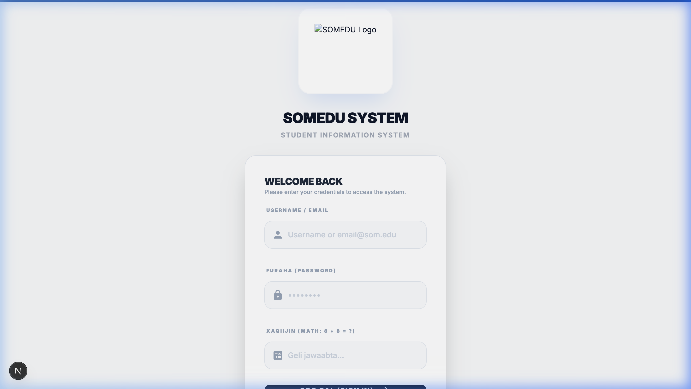

<div align="center">

# 🎓 SOMEDU — School Management System

**A modern, multi-tenant SaaS platform for digitizing school administration in Somalia.**

Built with **Next.js 15**, **Supabase**, and **Tailwind CSS**.

[](https://nextjs.org)
[](https://supabase.com)
[](https://www.typescriptlang.org)
[](https://tailwindcss.com)

</div>

---

## 📋 Overview

SOMEDU is a production-ready, mobile-first school management web application designed for Somali secondary schools. It replaces paper-based systems with a fast, secure, and easy-to-use digital platform covering attendance, grades, timetables, exams, and announcements.

Each school gets its own **fully isolated portal** — the system is architected for multi-tenancy with Row-Level Security (RLS) enforced at the database level.

---

## ✨ Features

### 👨‍💼 Admin (School Manager)
- Live dashboard with real-time student, teacher & class counts
- Full student & teacher management (upload via Excel/CSV)
- Password reset with forced change on first login
- Timetable builder (dynamic periods, weekend support)
- Exam schedule upload & management
- Announcement broadcasting to all roles
- **Smart Student Reports** — rule-based AI summary scoring attendance + subject grades (in Somali)

### 👩‍🏫 Teacher
- Weekly schedule view (dynamic, school-configured)
- Subject-based attendance marking (per class + per subject)
- Grade entry per student per exam
- Announcement inbox

### 🎒 Student
- Personal timetable (flexible periods)
- Exam results & grades view
- Attendance history
- Announcement feed

### 🔐 Security
- Supabase Row-Level Security (multi-tenant data isolation)
- Forced password change on first login
- Service Role key kept server-side only

---

## 📸 Screenshots

| Login Page |
|---|
|  |

---

## 🗂 Project Structure

```
├── app/
│   ├── (dashboard)/
│   │   ├── admin/          # Admin pages (students, teachers, timetable, reports...)
│   │   ├── teacher/        # Teacher pages (attendance, grades, schedule...)
│   │   └── student/        # Student pages (timetable, grades, exams...)
│   ├── sign-in/            # Authentication page
│   └── change-password/    # Forced password change
├── components/             # Shared UI components
├── lib/
│   ├── actions/            # Server Actions (admin.ts, teacher.ts, student.ts, reports.ts)
│   └── supabase/           # Supabase client (browser + server)
├── types/                  # TypeScript types and constants
└── public/                 # Static assets
```

---

## 🚀 Getting Started

### 1. Clone the repository
```bash
git clone https://github.com/MOHAMEDJAMA1/starbus.git
cd starbus
```

### 2. Install dependencies
```bash
npm install
```

### 3. Set up environment variables
```bash
cp .env.example .env.local
```
Then open `.env.local` and fill in your Supabase project URL and keys (see **Supabase Setup** below).

### 4. Run the development server
```bash
npm run dev
```

Open [http://localhost:3000](http://localhost:3000) in your browser.

---

## 🗄 Supabase Setup

1. Create a new project at [supabase.com](https://supabase.com).
2. Run the schema in `supabase_schema.sql` in the Supabase SQL editor to create all tables and RLS policies.
3. Copy your Project URL and API keys into `.env.local`.

---

## 🛠 Tech Stack

| Technology | Purpose |
|---|---|
| **Next.js 15** (App Router) | Full-stack React framework |
| **TypeScript** | Type safety |
| **Supabase** | PostgreSQL database, Auth, RLS |
| **Tailwind CSS** | Utility-first styling |
| **Vercel** | Deployment |

---

## 🌍 Multi-Tenancy

Each school is identified by a `school_id`. All database queries are filtered by this ID, and Supabase RLS policies enforce that users can **only access data belonging to their own school**. No school can see another school's data.

---

## 📄 License

This project is proprietary software developed by **Mohamed Jama**. All rights reserved.

---

<div align="center">
  Built with ❤️ for Somali schools
</div>
